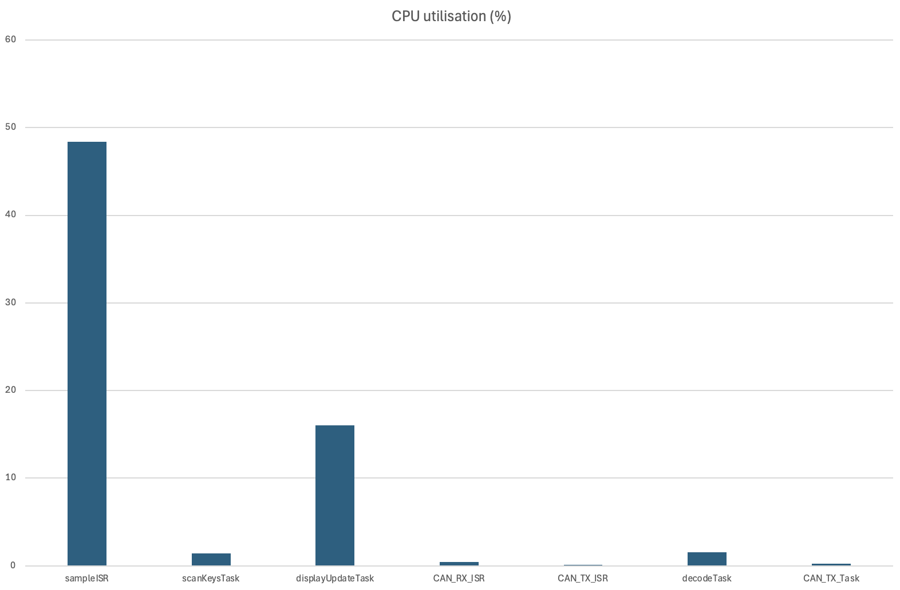

# Embedded Music Synthesizer

Real-time STM32 synthesizer with polyphony, live control, OLED UI, and CAN-based multi-board support.

---

## Table of Contents

- [Overview](#overview)
- [Task Identification](#task-identification)
- [Task Characterization](#task-characterization)
  - [2.1 Minimum Initiation Intervals](#21-minimum-initiation-intervals)
  - [2.2 Worst Case Execution Time / CPU Utilization](#22-worst-case-execution-time--cpu-utilization)
- [CPU Utilisation by Task](#cpu-utilisation-by-task)
- [Critical Instant Analysis](#critical-instant-analysis)
- [Shared Data Structures and Synchronisation](#shared-data-structures-and-synchronisation)
- [Deadlock Analysis](#deadlock-analysis)
- [Audio Pipeline](#audio-pipeline)
- [Controls and UI](#controls-and-ui)
  - [Display Pages](#display-pages)
- [Advanced Features](#advanced-features)

---

## Overview

This project implements a real-time embedded music synthesizer on STM32. The system combines polyphonic sound generation, live parameter control, OLED feedback, and CAN communication between connected boards.

Rather than using a single main loop, the synthesizer is split into RTOS tasks and hardware interrupts. This keeps audio generation separate from display, control, and communication logic.

---
## Demo Video

The video below demonstrates the functionality of our board. It covers the basic operations, how the system behaves when multiple boards are connected, and several advanced features we added.

## <put the video here 

---

## Task Identification

| Task / ISR | Type | FreeRTOS Priority | Trigger | Purpose |
|---|---|---:|---|---|
| `sampleISR` | Timer interrupt | - | 22 kHz hardware timer | Audio generation: modulation, voice mix, filter/effects, output write |
| `scanKeysTask` | Thread | 2 | Periodic (20 ms) | Key scan, joystick read, knob decode, local control update |
| `decodeTask` | Thread | 3 | Event-driven (`msgInQ`) | Decode CAN messages, update board/key state |
| `CAN_TX_Task` | Thread | 2 | Event-driven (`msgOutQ` + `CAN_TX_Semaphore`) | Transmit queued CAN frames |
| `displayUpdateTask` | Thread | 1 | Periodic (100 ms) | Refresh OLED menu and performance views |
| `CAN_RX_ISR` | Hardware interrupt | - | Event-driven | Push received CAN frame into `msgInQ` |
| `CAN_TX_ISR` | Hardware interrupt | - | Event-driven | Release TX mailbox via `CAN_TX_Semaphore` |

---

## Task Characterization

This section outlines each task in terms of its theoretical minimum initiation interval and Worst Case Execution Time & CPU Utilization.

### 2.1 Minimum Initiation Intervals

| Task / ISR | Minimum initiation interval | Assumptions used |
|---|---:|---|
| `sampleISR` | **45.45 us** | Timer interrupt configured at 22 kHz. |
| `scanKeysTask` | **20 ms** | Periodic task using `vTaskDelayUntil()` with a 20 ms period. |
| `displayUpdateTask` | **100 ms** | Periodic task using `vTaskDelayUntil()` with a 100 ms period. |
| `CAN_RX_ISR` | **0.7 ms** | Worst-case CAN traffic assumption: minimum CAN frame transmission interval taken as 0.7 ms. |
| `CAN_TX_ISR` | **0.7 ms** | One TX completion interrupt is produced per transmitted CAN frame, so the same minimum inter-arrival time is used. |
| `decodeTask` | **25.2 ms** | `msgInQ` length is 36. Under worst-case CAN traffic, the queue can fill in \(36 \times 0.7 = 25.2\) ms. |
| `CAN_TX_Task` | **60 ms** | `scanKeysTask` runs every 20 ms and can generate up to 12 outgoing messages each cycle, so a 36-item `msgOutQ` can fill in 60 ms. |

### 2.2 Worst Case Execution Time / CPU Utilization

The WCET values were measured separately by enabling the corresponding profiling `#define` one at a time. After collecting the timing result, CPU utilisation was calculated from the measured WCET and the minimum initiation interval.

| Task / ISR | WCET (us) | Minimum initiation interval | CPU utilisation (%) |
|---|---:|---:|---:|
| `sampleISR` | 22 | 45.45 us | 48.40 |
| `scanKeysTask` | 282 | 20000 us | 1.41 |
| `displayUpdateTask` | 16040 | 100000 us | 16.04 |
| `CAN_RX_ISR` | 3 | 700 us | 0.43 |
| `CAN_TX_ISR` | 1 | 700 us | 0.14 |
| `decodeTask` | 11 | 36 exec / 25.2 ms | 1.57 |
| `CAN_TX_Task` | 4 | 36 exec / 60 ms | 0.24 |

Total CPU utilisation = 68.23%

---

## CPU Utilisation Percentage Plot

  

---
## Critical Instant Analysis

The system uses fixed priorities, where interrupts run above the task level. Among the tasks, `decodeTask` has the highest priority, followed by `scanKeysTask` and `CAN_TX_Task`, while `displayUpdateTask` runs at the lowest priority.

In the critical instant case, all tasks and interrupts are assumed to be released at the same time. Based on the measured WCET values, each task still finishes within its minimum initiation interval. `sampleISR` is the most time-sensitive part of the system, but it still executes within its available time range. The other tasks also complete in time, so the schedule meets all deadlines under the worst-case conditions.

---

## Shared Data Structures and Synchronisation

Shared resources are protected with mutexes, queues, semaphores, and atomic access.

- **`sysState`**  
  Stores the main shared system state and is protected by `sysState.mutex`.

- **`msgInQ`**  
  Holds incoming CAN messages for `decodeTask`.

- **`msgOutQ`**  
  Holds outgoing CAN messages for `CAN_TX_Task`.

- **`CAN_TX_Semaphore`**  
  Used to control access to CAN transmit mailboxes.

- **`pitchBendValue`**  
  Shared pitch bend value used by the audio engine.

---

## Audio Pipeline

| Stage | Function |
|---|---|
| **Voice allocation** | Polyphonic note assignment with voice stealing when needed |
| **Oscillators** | Morphing OSC1, selectable OSC2, and sub oscillator |
| **Tone shaping** | Noise, ring modulation, sync, and wavefolding |
| **Envelope** | ADSR envelope and modulation envelope |
| **Modulation** | LFO, sample-and-hold, glide, and pitch bend |
| **Filter** | Filter stage with cutoff and resonance control |
| **Effects** | Delay, chorus, bit reduction, and decimation |
| **Output** | Final level scaling and audio output |

---

## Controls and UI

| Control Element | Purpose |
|---|---|
| **Keyboard matrix** | Local note input |
| **Rotary controls** | Parameter adjustment on each page |
| **Joystick** | Page navigation, or pitch bend when enabled |
| **OLED display** | Shows performance and parameter pages |
| **Board connection logic** | Detects neighbouring boards for multi-board use |

### Display Pages

- Performance page
- Oscillator page
- Oscillator extension page
- Filter page
- Envelope page
- Modulation page
- Effects page

---

## Advanced Features

| Feature | Description |
|---|---|
| **Polyphony** | Plays multiple notes at the same time |
| **Voice stealing** | Reuses voices when all are busy |
| **Wave morphing** | Smoothly changes the OSC1 waveform |
| **Pitch bend** | Adds real-time control during play |
| **Built-in effects** | Extends the sound beyond the dry synth signal |
| **Multi-board CAN support** | Lets several boards work as one wider keyboard |
